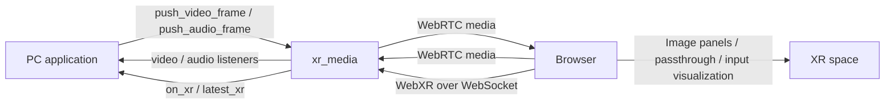

# xr_media

[English](README.md) | [简体中文](README.zh-CN.md)

Python SDK for multi-stream bidirectional audio/video, image panels in XR, and XR input data.

## Features

- **Bidirectional audio/video**: configurable media cards connecting PC applications and browsers.
- **Image panels in XR**: display video cards in an XR space.
- **Passthrough**: XR passthrough mode on supported devices and browsers.
- **Input visualization**: controller and hand coordinate axes, with hand-joint keypoint UI.
- **XR data**: headset/controller poses, buttons, thumbsticks, hand-joint poses and tracking state.

**Tested devices:** PICO 4 and Meta Quest 3 worked successfully in testing. Feature availability depends on the device OS and browser.

## Architecture



## Install

Requires Python 3.10+ and Git for Git-based installation. Create and activate an environment:

```bash
python3 -m venv .venv
source .venv/bin/activate
```

### 1. Install from Git (recommended)

Install the SDK and its Python dependencies:

```bash
python -m pip install "git+https://github.com/AgilexOpensource/xr_media.git"
```

For cameras or local video files, use the command including OpenCV instead:

```bash
python -m pip install "xr_media[opencv] @ git+https://github.com/AgilexOpensource/xr_media.git"
```

### 2. Clone and install

```bash
git clone https://github.com/AgilexOpensource/xr_media.git
cd xr_media
python -m pip install .
```

For OpenCV, replace the last line with `python -m pip install '.[opencv]'`.

### 3. Use Colcon

In an existing ROS 2 workspace, place the SDK source at `src/xr_media`. With ROS loaded and a compatible Python environment, run from the workspace root:

```bash
python -m pip install setuptools aiohttp aiortc av numpy
colcon build --packages-select xr_media --symlink-install
source install/setup.bash
```

Colcon installs the SDK; Python dependencies must still be prepared separately. For
Colcon-installed SDKs, run the CLI with `python -m xr_media.cli` rather than the
pip-generated `xr_media` shortcut. For a combined bridge build, see
[xr_media_ros](https://github.com/AgilexOpensource/xr_media_ros).

### Use uv (optional)

Install directly:

```bash
uv venv .venv
source .venv/bin/activate
uv pip install "git+https://github.com/AgilexOpensource/xr_media.git"
xr_media --stream video_test
```

For source development, run inside the cloned repository:

```bash
uv sync --extra dev
uv run xr_media --stream video_test
uv run python example.py
```

Replace `example.py` with your saved example file. For cameras or local video files, use `uv sync --extra dev --extra opencv` and add `--extra opencv` when running. Choose one workflow; use a dedicated environment for source development rather than syncing a shared ROS environment.

For temporary PC camera use, run `uv run --with opencv-python-headless xr_media --stream camera:0` to add OpenCV for that run only.

## Generate certificates

Run manually; requires Bash and OpenSSL:

```bash
xr_media --init-certs
```

Each run generates and overwrites `cert.pem` and `key.pem`. After replacement, restart the server and configure certificate trust on viewing devices.

## Examples

Test video:

```bash
xr_media --stream video_test
```

Bidirectional audio/video:

```bash
xr_media --stream video_test --stream audio_test --stream video_input --stream audio_input
```

Camera, video file or audio file (choose one command and replace file paths):

```bash
xr_media --stream 'front=camera:0,width:640,height:480'
xr_media --stream 'movie=video_file:/path/to/movie.mp4'
xr_media --stream 'music=audio_file:/path/to/music.wav'
```

Open a printed URL. Select a source and start each uplink card. Stop the server with `Ctrl+C`.

Run `xr_media --help` to see all CLI options and their descriptions.

## More

- [API reference](docs/API.md): audio/video, XR data, parameters, callbacks and complete examples.
- [xr_media_ros](https://github.com/AgilexOpensource/xr_media_ros): ROS 2 bridge for media topics and XR data.

## License

Apache-2.0; see [LICENSE](LICENSE). Three.js uses the MIT license; see [third-party license](static/vendor/THREE-LICENSE.txt).
