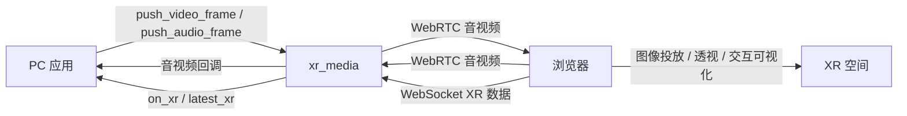

# xr_media

[English](README.md) | [简体中文](README.zh-CN.md)

支持多路双向音视频、XR 图像投放与交互数据回传的 Python SDK。

## 核心能力

- **双向音视频**：按需配置多路媒体卡片，连接 PC 应用与浏览器。
- **XR 图像投放**：将视频卡片展示在 XR 空间中。
- **透视显示**：支持 XR 透视模式，需要设备与浏览器支持。
- **交互可视化**：绘制手柄与手部坐标轴、手部关节关键点 UI。
- **XR 数据输出**：头显与控制器位姿、按键、摇杆、手部关节位姿及跟踪状态。

**设备实测：** PICO 4、Meta Quest 3 测试正常；具体功能以设备系统和浏览器支持为准。

## 框架



## 安装

需要 Python 3.10+；Git 安装方式还需要 Git。先创建并激活环境：

```bash
python3 -m venv .venv
source .venv/bin/activate
```

### 1. 从 Git 安装（推荐）

安装 SDK 及其 Python 依赖：

```bash
python -m pip install "git+https://github.com/kehuanjack/xr_media.git"
```

使用摄像头或本地视频文件时，改用包含 OpenCV 的安装命令：

```bash
python -m pip install "xr_media[opencv] @ git+https://github.com/kehuanjack/xr_media.git"
```

### 2. 克隆后安装

```bash
git clone https://github.com/kehuanjack/xr_media.git
cd xr_media
python -m pip install .
```

需要 OpenCV 时，将最后一行改为 `python -m pip install '.[opencv]'`。

### 3. 使用 Colcon

已有 ROS 2 工作空间时，可将 SDK 源码放入 `src/xr_media`。在已加载 ROS 环境且使用兼容 Python 的工作空间根目录执行：

```bash
python -m pip install setuptools aiohttp aiortc av numpy
python /usr/bin/colcon build --packages-select xr_media --symlink-install
source install/setup.bash
```

此方式由 Colcon 安装 SDK，Python 依赖仍需单独准备；与 ROS 桥接一起构建见 [xr_media_ros](https://github.com/kehuanjack/xr_media_ros)。

### 使用 uv（可选）

直接安装：

```bash
uv venv .venv
source .venv/bin/activate
uv pip install "git+https://github.com/kehuanjack/xr_media.git"
xr_media --stream video_test
```

从源码开发时，在克隆后的仓库目录执行：

```bash
uv sync --extra dev
uv run xr_media --stream video_test
uv run python example.py
```

将 `example.py` 替换为保存的示例文件。需要摄像头或本地视频文件时，使用 `uv sync --extra dev --extra opencv`，运行时添加 `--extra opencv`。两种方式选一种；源码开发使用独立环境，避免同步共享 ROS 环境。

临时使用 PC 摄像头时，也可运行 `uv run --with opencv-python-headless xr_media --stream camera:0`，仅为本次运行添加 OpenCV。

## 生成证书

手动执行，需要 Bash 和 OpenSSL：

```bash
xr_media --init-certs
```

每次执行都会重新生成并覆盖 `cert.pem` 和 `key.pem`。换证后重启服务，并在访问设备上配置信任。

## 运行示例

测试视频：

```bash
xr_media --stream video_test
```

音视频双向传输：

```bash
xr_media --stream video_test --stream audio_test --stream video_input --stream audio_input
```

摄像头、视频文件或音频文件（选择一条执行，替换文件路径）：

```bash
xr_media --stream 'front=camera:0,width:640,height:480'
xr_media --stream 'movie=video_file:/path/to/movie.mp4'
xr_media --stream 'music=audio_file:/path/to/music.wav'
```

打开终端打印的地址。上行卡片选择来源并点击启动；`Ctrl+C` 停止服务。

运行 `xr_media --help` 查看完整的 CLI 参数及说明。

## 更多用法

- [API 参考](docs/API.zh-CN.md)：音视频收发、XR 数据、参数、回调及完整示例。
- [xr_media_ros](https://github.com/kehuanjack/xr_media_ros)：音视频话题与 XR 数据的 ROS 2 桥接包。

## 许可证

Apache-2.0，见 [LICENSE](LICENSE)。Three.js 使用 MIT 许可证，见 [第三方许可](static/vendor/THREE-LICENSE.txt)。
